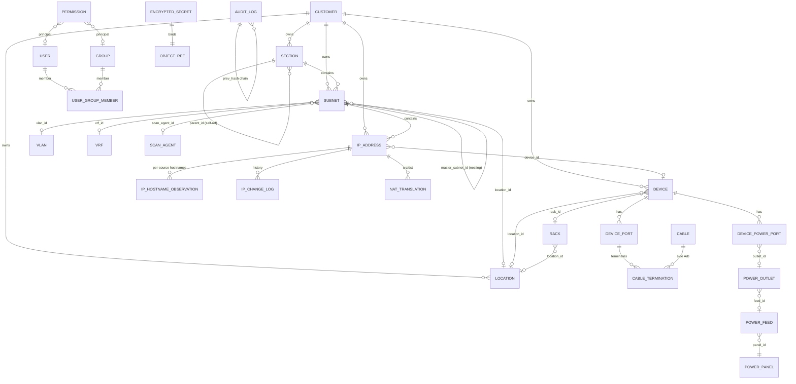

# jt-ipam Core Data Model

> 繁體中文版：[DATA_MODEL_zh-TW.md](DATA_MODEL_zh-TW.md)

> Backend: SQLAlchemy 2.0 (async) + PostgreSQL 16 + Alembic, using native `inet` / `cidr` / `macaddr` / `citext` / `jsonb` types. UUID primary keys throughout (except a few high-volume / chained log tables that use `bigint`).
>
> This document tracks the **current** model. It is generated from the ORM under `backend/app/models/`. Migrations live in `backend/alembic/versions/` (latest ~0080). The model is described entity-by-entity with the relationships/foreign keys that matter; not every column is listed.

---

## 1. ER diagram (core)



---

## 2. IPAM core

### 2.1 `customers` — management unit / tenant
The customer (management unit) is jt-ipam's ownership anchor. Unlike phpIPAM (section/subnet only), a `customer_id` FK hangs off **sections, subnets, IP addresses, devices, locations, virt clusters, VLANs**. Customer scoping also drives the IP relationship chain (e.g. linking an IP only to VMs of the same customer).

- `name` (unique slug), `title` (display name), `description`, `contact`, `email`, `phone`, `address`.

### 2.2 `sections`
Top-level grouping. Self-referential `parent_id` (SET NULL) for nesting; `strict_mode`, `display_order`, optional `customer_id`.

### 2.3 `subnets`
- `section_id` (CASCADE, required), `master_subnet_id` (self-ref nesting), `cidr` (native `cidr`).
- `vlan_id`, `vrf_id`, `location_id`, `customer_id`, `gateway` (`inet`), `dns_servers` (comma-separated).
- `is_pool`, `is_full`, `threshold_pct` (utilization alert), `auto_dns`.
- `archived_at` — non-NULL = archived: data is kept but hidden, not scanned, and ignored by overlap checks (archived child IPs are hidden too).
- **Scanning**: `scan_enabled`, `scan_method` (`text[]`, default `{icmp}`), `scan_agent_id` (FK → scan_agents; if set, the subnet is scanned via that agent rather than the local host).
- `custom_fields` (jsonb). GiST index on `cidr`.

### 2.4 `ip_addresses`
- `subnet_id` (CASCADE), `ip` (`inet`), unique on `(subnet_id, ip)`, GiST index on `ip`.
- `hostname` (resolved effective value), `description`, `owner`, `note`, `state` (`active`/`reserved`/`offline`/`dhcp`/`used`), `customer_id`, `device_id`.
- **MAC / switch location**: `mac` (`macaddr`), `mac_source` (which feed it came from, for ARP precedence), `switch_port`, `switch_port_confident` (FDB-derived; false on uplink/trunk ports carrying multiple MACs).
- **Probe / scan**: `exclude_from_ping`; `excluded_probes` (`text[]`) — per-IP set of probes to skip (icmp stays in sync with `exclude_from_ping`); `probe_last_run` (jsonb, `{probe: timestamp}` for "next due" display).
- **OS fingerprint**: `os_guess` (raw string), `os_family` (normalized key for icon mapping; see `core/os_fingerprint.py`).
- **Hostname precedence**: `hostname_source_pin` — pin the effective hostname to one source (NULL = follow the global precedence order). The per-source raw hostnames live in `ip_hostname_observations`.
- **Multi-source liveness**: `discovery_source` (`manual`/`scanner`/`librenms`/`dns`/`proxmox`/`opnsense`/`phpipam`), `last_seen_scanner`, `last_seen_librenms`, `last_seen_dns`, `effective_status` (lowercase, e.g. `online`/`online (scanner)`/`online (librenms)`/`offline`).
- `in_dhcp_lease` (auto-flagged from the firewall's DHCP leases), `ptr_ignore`, `custom_fields` (jsonb).

### 2.5 `ip_hostname_observations`
One row per `(ip, source)` storing the hostname that source reported. `IPAddress.hostname` is the value resolved from these by the global precedence order plus the per-IP pin (resolution in `services/hostname.py`). Sources: manual / scanner / librenms / dns / proxmox / opnsense / wazuh / adguard.

### 2.6 `ip_change_log`
High-frequency history of every IP change (created/deleted/hostname_changed/mac_changed/state_changed/online/offline/arp_changed/edited). Deliberately **not** part of the audit SHA-256 chain (sync-driven online/offline/ARP events are too frequent to serialize through the chain). Keeps `ip_text` / `subnet_id` snapshots so history survives IP deletion (FKs SET NULL). Indexed by `(ip_id, created_at)`.

### 2.7 `nat_translations`
phpIPAM's signature NAT, extended to mirror OPNsense port-forward rules.
- `type` (`one_to_one`/`many_to_one`/`port_forward`), `src_ip_id`/`dst_ip_id` (FK ip_addresses), `src_port`/`dst_port` (+ `_to` for ranges), `protocol`, `src_interface`, `device_id`.
- OPNsense parity: `disabled`, `no_rdr`, `ip_version`, `src_not`/`dst_not`, `log`, `category`, `nat_reflection`, `pool_options`, `filter_rule`, and alias references (`src_alias`/`dst_alias`/`src_port_alias`/`dst_port_alias`/`redirect_alias`).
- Sync provenance: `source_origin` (`manual` / `phpipam` / `opnsense:<fw_uuid>`) + `external_id` (unique together = upsert key).

### 2.8 `ip_requests` / `ip_request_events`
IP request workflow with a clear state machine (`pending → approved → fulfilled` / `rejected` / `cancelled`). `ip_request_events` is the timeline (one row per state change). Approval allocates an IP atomically (`allocated_ip_id`).

---

## 3. Scan agents & the probe model

### 3.1 `scan_agents`
Multi-point scanning. Agents are deployed inside target segments (cross-segment scanning from the central host is blocked by firewalls). The current model is **push**: the agent connects out to the server.
- `name`, `description`, `enabled`, `agent_url` (legacy pull model, optional).
- Auth: `enroll_key_hash` (sha256 of an enrollment key shown once at creation) for push; `api_token_enc`/`api_token_nonce` (AES-GCM) for legacy pull.
- Telemetry: `last_seen_at`, `last_error`, `agent_version`, `last_source_ip`.
- **Probe config**: `enabled_probes` (`text[]`, capability ceiling, default `{icmp}`), `probe_intervals` (jsonb `{probe: seconds}` overrides), `available_probes` (`text[]`, what the agent actually reports it can run — used to grey out the UI), `force_scan_at` (admin "run now" — agent picks it up on next poll, then it is cleared, forcing all probes due this cycle).

### 3.2 Three-layer probe resolution
The set of probes actually run on an IP is:

```
agent.enabled_probes  ∩  subnet.scan_method  −  ip.excluded_probes
```

i.e. the agent's capability ceiling, intersected with the subnet's chosen methods, minus the per-IP exclusions. Probe catalog and defaults live in `app/core/scan_probes.py`.

---

## 4. Devices & physical layer

### 4.1 `devices`
- `name`, `fqdn`, `primary_ip_id` (FK ip_addresses, use_alter), `type` (`server`/`switch`/`router`/`firewall`/`ap`/`storage`/`ipmi`/`other`), `vendor`, `model`, `serial`, `customer_id`, `custom_fields`.
- Rack placement: `location_id`, `rack_id`, `u_position`, `u_size`, `rack_face` (`front`/`rear`), `rack_side` (`full`/`left`/`right` — half-U devices share one U).

### 4.2 `locations` (= data centre / room) and `racks`
- **Location**: `name` (unique), `address`, `latitude`/`longitude`, `customer_id`, `floor_plan_path` (uploaded floor-plan background; a location doubles as a "room").
- **Rack**: `location_id`, `name`, `u_height` (default 42), physical `width_mm`/`depth_mm` (for to-scale floor-plan footprints), `seq` (left-to-right ordering), `numbering` (`top-down`/`bottom-up`), `face` (`front`/`rear`), floor-plan placement `pos_x`/`pos_y` (0..1 ratio), `pos_rot` (arbitrary rotation degrees), `pos_w`/`pos_h`.

### 4.3 Cabling — `device_ports`, `cables`, `cable_terminations`
NetBox-style but condensed (one polymorphic termination table instead of per-type tables).
- **DevicePort**: a port/interface on a device; `type` (`network`/`front`/`rear`/`console`/`power`), `peer_port_id` (front↔rear pass-through for patch-panel traversal), `position`, `mac_address` (the port's own physical MAC, e.g. LibreNMS `ifPhysAddress` — not a learned peer MAC). Unique `(device_id, name)`.
- **Cable**: `label`, `type` (`cat6`/`fiber-mm`/`fiber-sm`/`power`), `color`, `length_m`, `status` (`planned`/`connected`/`decommissioned`).
- **CableTermination**: the two ends of a cable; `side` (`A`/`B`), polymorphic `(object_type, object_id)` (device / patch-panel port / outlet …), `port_label`. Cable Trace walks these plus port `peer_port_id` links for multi-hop pass-through.

### 4.4 Power — NetBox-style
- **PowerPanel** → **PowerFeed** (`voltage_v`, `amperage_a`, `phase` single/three, `supply_type` ac/dc, optional `rack_id`) → **PowerOutlet** (`feed_id`, `rack_id`, `label`).
- **DevicePowerPort**: a device-side PSU/power input (e.g. PSU1/PSU2), `outlet_id` (FK power_outlets; NULL = unconnected), `max_watts`. A device can have several so dual-PSU redundancy across A/B circuits is modelled.

---

## 5. Global infrastructure (advanced resources)

These are global infra (no per-object authorization); UI exposure is gated by `require_global_read`. All support CRUD/PATCH.

- **`vlan_domains` / `vlans`**: VLAN `number` (1–4094, unique within domain), `name`, optional `customer_id` / `section_id`. **`device_vlans`** links `librenms_devices ↔ vlans` (pull-only, written by LibreNMS sync; deliberately keyed off the LibreNMS device, not a jt-ipam Device).
- **`vrfs`**: `name` (unique), `rd` (Route Distinguisher), `allow_overlap`.
- **`asns`**: `asn` (bigint, unique), `rir`, optional `tenant_id`.
- **Tenancy**: `tenant_groups` (self-ref) → `tenants` (`slug`, `group_id`).
- **Circuits**: `providers` → `circuits` (`cid` unique per provider, `type_id` → `circuit_types`, `status`, dates, `monthly_fee_cents`, `commit_rate_kbps`, asymmetric `up_kbps`/`down_kbps`, optional fixed-IP fields `ip_address`/`gateway`/`netmask`/`dns_servers`, `device_id` for the WAN-facing device, `tenant_id`).
- **Contacts**: `contact_groups` (self-ref), `contact_roles`, `contacts`, and `contact_assignments` (assign a contact+role to any object via polymorphic `(object_type, object_id)`).
- **Wireless**: `wireless_ssids` (`ssid`, `auth_type`, `vlan_id`, `tenant_id`), `wireless_links` (point-to-point A/B devices).
- **VPN**: `vpn_tunnels` — `type` (ipsec_ikev1/ikev2/wireguard/openvpn/l2tp/vxlan/vpls/evpn/other), A/B device + endpoint, WireGuard `local_public_key`/`peer_public_key` for reliable pairing, `pairing_method` (`wireguard_pubkey` reliable / `ipsec_endpoint` best-effort) for UI confidence.

---

## 6. Integrations

Each integration has an **instance** table (connection metadata; API keys/passwords are AES-GCM encrypted, generally in dual `*_enc` / `*_nonce` columns or via `encrypted_secrets`) plus **synced** tables (pull-only caches).

### 6.1 LibreNMS — `librenms.py`
- **LibreNMSInstance**: `api_url`, encrypted token, per-feature toggles (`sync_devices`/`sync_arp`/`sync_fdb`/`sync_vlans`/`use_for_status`/`auto_add_devices`/`auto_create_ips`), `scope_subnet_ids` (jsonb — restrict IP resolution to specific subnets, to disambiguate overlapping segments), interval + last_sync/error. `auto_create_ips` (default on) creates an `ip_addresses` row for a monitored device's primary IP when it falls inside an existing, in-scope subnet.
- **LibreNMSDevice**: pulled device (`legacy_device_id` = LibreNMS id), `hostname`/`sysname`/`primary_ip`/`hardware`/`os`/`status`, `jt_ipam_device_id` link.
- **ARPEntry**: IP↔MAC from `/resources/ip/arp/`, with `interface`/`vrf`, used to backfill IP MACs.
- **FDBEntry**: MAC location from `/devices/{id}/fdb` (`port_name`, `vlan_id_num`), used to derive switch port.

### 6.2 Wazuh — `wazuh.py`
- **WazuhInstance**: `api_url`, `api_user` + encrypted password, `verify_tls`.
- **WazuhAgent**: per-sync agent (`agent_id`, `ip`, `status`, OS/version, `group`, keep-alive), linked to an IP via `jt_ipam_address_id`, plus vulnerability summary counts (`cve_critical_count`/`cve_high_count`/`cve_summary_at`).

### 6.3 OPNsense firewall — `firewall.py`, `firewall_rule.py`, `nat.py`, `dhcp.py`
- **OPNsenseFirewall**: encrypted `api_key` + `api_secret`, `verify_tls`, sync toggles (`sync_dhcp`/`sync_arp`/`sync_openvpn`/`sync_rules`/`sync_nat`/`sync_aliases`), and `expose_dsv` (opt-in: expose this firewall's rule-label→alias and alias→members lookups as Graylog DSV).
- **OPNsenseAliasMapping**: jt-ipam scope → OPNsense alias push rule; `selector` (jsonb: section/subnet/tag/custom_field), `direction` (push/pull/both), last sync state.
- **OPNsenseSyncedAlias**: aliases pulled back from OPNsense for read-only viewing (`content`, `member_count`); also the source for the alias→members Graylog DSV.
- **OPNsenseRuleLabel**: parsed from `pf_statistics` — maps a filterlog `rid` (pf rule label) to the alias(es) the rule references (`label`, `action`, `interface`, `alias_names` jsonb). Feeds the rule→alias Graylog DSV so log events can be enriched by `rid`.
- **OPNsenseRule**: firewall rules pulled as a read-only cache (`legacy_uuid`, action/interface/direction/protocol, src/dst net & port, `raw` jsonb).
- **DHCPPoolRange**: DHCP pool ranges synced from the firewall (Kea/ISC) — `subnet_cidr`, `start_ip`/`end_ip`; IPs falling in a range are flagged DHCP.

> **Graylog DSV** (token-protected lookup endpoints under `/api/v1/lookup/...`): a global IP→hostname/FQDN table, per-firewall `rid → alias` and `alias → members` tables (gated by `expose_dsv`), and per-cluster Proxmox `vmid → VM name`. Consumed by Graylog's "DSV File from HTTP" data adapter (key column 0, value column 1).

### 6.4 Proxmox virtualization — `virt.py`
- **ProxmoxInstance**: PVE API connection (`api_url` + `extra_api_urls` for node failover, `auth_username`/`auth_token_id`, secret via `encrypted_secrets`, `verify_tls`).
- **VirtCluster**: a Proxmox cluster (`type`, `is_standalone`, `location_id`, `tenant_id`, `customer_id`).
- **VirtualMachine**: VM/CT (`legacy_vmid`, `node`, `kind` vm/ct, `status`, vcpus/memory/disk), `primary_ip_id`, `device_id` link, `is_template`.
- **VMInterface**: `mac`, `primary_ip`, `bridge`, `vlan_id`.

### 6.5 DNS — `dns.py`
- **DNSServer**: provider abstraction `type` (powerdns/bind9/unbound_opnsense/windows_dns/univention_ucs); credentials in `encrypted_secrets`.
- **DNSZone**: `type` (forward/reverse), `managed`, `associated_subnet_ids` (`uuid[]`).
- **DNSRecord**: `type` (A/AAAA/PTR/CNAME/MX/TXT/SRV/NS/SOA), `source` (manual/from_ipam/from_dns_pulled), `consistency_state` (consistent/dns_only/ipam_only/mismatch) for the drift report, optional `ipam_address_id` back-link.

### 6.6 AdGuard Home — `adguard.py`
- **AdGuardInstance**: HTTP basic-auth (encrypted password), `sync_clients` / `sync_rewrites` toggles. Pull-only enrichment of IPAM data.

### 6.7 phpIPAM migration — `migration_mapping.py`
- **PhpIPAMMigrationMapping**: `(object_type, legacy_id)` → `jt_ipam_id`, with `last_synced_hash` (sha256 of canonical JSON) for idempotent re-runs / change detection and `last_seen_at` for deletion detection.

### 6.8 OUI — `oui.py`
- **OUIVendor**: IEEE MAC vendor lookup. PK = 6-hex `prefix` (first 24 bits), `short_name` / `name`, `source` (Wireshark `manuf`, refreshed monthly).

---

## 7. AI / LLM

- **`ai_chat_conversations`** (per user, `title` from the first question) → **`ai_chat_messages`** (`role` user/assistant, `content`, `model`, `elapsed_ms`; `created_at` uses `clock_timestamp()` so same-turn user→assistant ordering is preserved). Only final Q&A is stored — no tool traces (those carry internal data). Retention is admin-configured via `system_settings.ai_chat.retention_days`.

---

## 8. Security, RBAC & system

### 8.1 `users` / `groups` / `user_group_members`
- **User**: `username`/`email` (citext unique), `password_hash` (argon2id; NULL for external auth), `auth_provider` (local/ldap/radius/saml/oidc), `external_subject`, `is_active`, `is_admin`, encrypted TOTP (`totp_secret_enc`/`totp_nonce`), lockout (`failed_login_count`/`locked_until`), `last_login_at`/`last_login_ip`. CHECK: local users must have a password.
- **Group**: `name` (citext unique), `is_builtin`. Membership via `user_group_members` (composite PK).

### 8.2 `permissions` — object-level RBAC (deny by default, A01)
Object-level authorization: `(object_type, object_id, principal_type, principal_id, level)`.
- `object_type` ∈ `customer / section / subnet / ip / device / rack / location` (the 7 grantable types).
- `object_id` NULL = wildcard (all objects of that type).
- `principal_type` ∈ `user / group`; `level` ∈ `read / write / admin`.
- Unique on `(object_type, object_id, principal_type, principal_id)`. Anything not granted = no access. `visible_ids()` returns None (all visible — admin or wildcard) / a set (limited) / empty set (none); every list / detail / search / dashboard aggregate / count must scope to it.

### 8.3 `audit_logs` — SHA-256 chain (A08)
`bigint` PK; `actor_user_id`/`actor_ip`/`actor_user_agent`, `object_type`/`object_id` (UUID), `action`, `diff` (jsonb, sensitive fields redacted), `request_id`. `prev_hash` + `this_hash` form a tamper-evident chain; writes are serialized via advisory lock. `object_id` must be a real UUID (don't stuff non-UUIDs).

### 8.4 `encrypted_secrets` (A02 / A04)
AES-256-GCM vault for any sensitive field. `(object_type, object_id, field, key_id)` unique; `ciphertext` + `nonce`. Backs DNS/Proxmox credentials, SNMP communities, TOTP, etc.

### 8.5 `api_tokens`
`token_hash` (sha256 — plaintext never stored) + `token_prefix` for identification, `scopes` (`text[]`), `object_filters` (jsonb ACL), `expires_at` (required), usage/revocation timestamps.

### 8.6 `custom_field_definitions`
Admin-defined fields for `object_type` ∈ `subnet / ip / device`. `field_type` ∈ text/int/float/bool/date/select/multi_select/regex, with `options`/`validation_regex`/`required`/`display_order`. Values are validated and stored in each entity's `custom_fields` jsonb. Unique `(object_type, name)`.

### 8.7 `user_preferences`
Per-user (PK = user_id): `locale` (zh-TW/en-US), `theme`, `timezone`, `calendar` (gregorian/minguo), `page_size`, `table_columns` (jsonb — per-table visible columns), `pinned_subnet_ids` (jsonb — dashboard "favourite subnets"), `pinned` (jsonb `{namespace: [id…]}` — generic pins for rooms/locations/racks, stored server-side rather than in localStorage). Note: the online-grace threshold moved to a global setting (`system_settings.online_grace_minutes`), it is no longer a preference.

### 8.8 `system_settings`
Admin key/value store (`key` PK, `value` jsonb, `updated_by`) overriding env. Holds, among others: **source precedence ordering** for hostname / ARP-MAC / device-name / device-model / OS resolution, `online_grace_minutes`, LLM config, AI chat retention.

### 8.9 `notifications` / `webhook_subscriptions`
- **Notification**: in-app per-user (`severity`, `title`, `body`, `link`, optional `object_type`/`object_id`, `read_at`).
- **WebhookSubscription**: outbound (`target_url`, `events` `text[]`, encrypted HMAC `secret`, `headers`, failure tracking). Delivery goes through `safe_http` SSRF checks.

### 8.10 `background_tasks`
Unified record for long-running jobs (`librenms.sync` / `opnsense.sync` / `dns.sync` / `phpipam.migration` / `scanner.run` …): `kind`, `status` (pending/running/succeeded/failed/cancelled), `target_*`, `progress` (0–100), `summary` (jsonb), timestamps. Surfaced at `/api/v1/tasks`.

### 8.11 Certificate storage & distribution — `certificate.py`
- **Certificate**: a managed certificate (`name`, `domains`/SAN, `source_type` (`none`/`url`/`sftp`) + `source_config` jsonb for periodic auto-fetch, `fetch_interval_seconds`, `last_fetch_at`/`last_fetch_error`).
- **CertVersion**: each uploaded/fetched version — `fingerprint_sha256`, `subject`/`issuer`/`serial`, `not_before`/`not_after`, `cert_pem`/`chain_pem`, AES-GCM-encrypted private key (`key_enc`/`key_nonce`), `is_current`. Missing intermediate/root certs can be completed from the system trust store.
- **CertAgent**: a per-host distribution agent — `enroll_key_hash`, `scope_cert_ids` (jsonb, deny-by-default), `device_id` (link to a jt-ipam device; name + source IP become clickable in the UI), `last_source_ip` / `recent_sources` (same-key-multi-host detection), `agent_version`, `reported` (jsonb deployment state). The pure-bash agent pulls certs over an `X-Agent-Key` and deploys them to nginx / apache / haproxy / Proxmox VE·PMG·PBS / Zimbra / … with config-test → rollback-on-failure → reload. Private keys are released only to a scoped agent over TLS, each access audited; expiry / drift raises alerts.

---

## 9. Naming & indexing conventions

- Primary keys: UUID (time-ordered) on entities; `bigint` on `audit_logs` / `phpipam_migration_mapping`.
- Enumerations: `text` + CHECK constraint (avoids PG enum value-change pain).
- Time columns: always `timestamptz` (stored as UTC).
- Network types: native `inet` / `cidr` / `macaddr`, with GiST indexes on `subnets.cidr` and `ip_addresses.ip` for containment/overlap queries.
- Polymorphic links use `(object_type, object_id)` (cable terminations, contact assignments, encrypted secrets, notifications).
- Soft delete is avoided; archival uses `archived_at` (subnets) and revocation timestamps (tokens) where needed.

---

## 10. Migration strategy

- Alembic auto-generate is always reviewed manually; never applied blindly.
- Migrations are effectively forward-only; a `downgrade()` is kept for dev.
- Run on a staging/clean container before prod. The current head is around `0080`.
