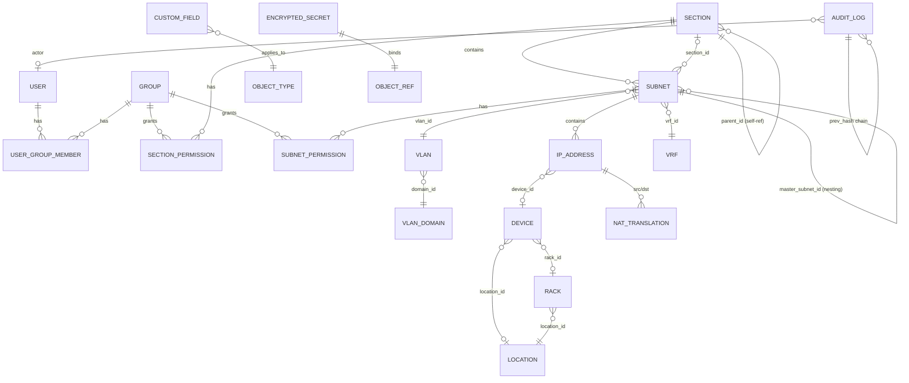

# jt-ipam 核心資料模型

> Phase 1 範圍：Section / Subnet / IP Address / VLAN / VRF / Device / Rack / Location / NAT / User / Group / AuditLog / EncryptedSecret / CustomField。
>
> 後端：SQLAlchemy 2.0 + PostgreSQL 16，使用原生 `inet` / `cidr` / `macaddr` / `jsonb` 型別。

---

## 一、ER 圖（核心）



---

## 二、Phase 1 資料表

### 2.1 `users`
| 欄位 | 型別 | 說明 |
|------|------|------|
| id | UUID | PK |
| username | citext UNIQUE | 大小寫不敏感唯一 |
| email | citext UNIQUE | |
| display_name | text | |
| password_hash | text | argon2id；外部驗證者（LDAP/OIDC）為 NULL |
| auth_provider | text | local / ldap / radius / saml / oidc |
| external_subject | text | OIDC sub / SAML NameID / LDAP DN |
| is_active | bool | |
| is_admin | bool | superuser |
| totp_secret_enc | bytea | 加密儲存的 TOTP secret（NULL 表未啟用） |
| failed_login_count | int | |
| locked_until | timestamptz | NULL 或解鎖時間 |
| last_login_at | timestamptz | |
| last_login_ip | inet | |
| created_at | timestamptz | |
| updated_at | timestamptz | |

> A02：`password_hash` 與 `totp_secret_enc` 永遠加密。`totp_secret_enc` 由 `EncryptedSecret` 工具加密。
> A07：`failed_login_count` / `locked_until` 用於帳號鎖定。

### 2.2 `groups`
| 欄位 | 型別 | 說明 |
|------|------|------|
| id | UUID | PK |
| name | citext UNIQUE | |
| description | text | |
| is_builtin | bool | 例如 admin / readonly 等內建群組 |

### 2.3 `user_group_members`
| 欄位 | 型別 | 說明 |
|---|---|---|
| user_id | UUID FK | |
| group_id | UUID FK | |
| (PK: user_id, group_id) | | |

### 2.4 `sections`
| 欄位 | 型別 | 說明 |
|------|------|------|
| id | UUID | PK |
| name | text | |
| description | text | |
| parent_id | UUID FK sections.id | 巢狀 |
| strict_mode | bool | phpIPAM 一致 |
| display_order | int | |
| created_at / updated_at | timestamptz | |

INDEX: (parent_id), (name)

### 2.5 `vlan_domains`
| 欄位 | 型別 | 說明 |
|---|---|---|
| id | UUID | |
| name | citext UNIQUE | |
| description | text | |

### 2.6 `vlans`
| 欄位 | 型別 | 說明 |
|------|------|------|
| id | UUID | PK |
| domain_id | UUID FK | |
| number | int | 1–4094 |
| name | text | |
| description | text | |
| (UNIQUE: domain_id, number) | | |

CHECK: number BETWEEN 1 AND 4094

### 2.7 `vrfs`
| 欄位 | 型別 | 說明 |
|------|------|------|
| id | UUID | |
| name | text UNIQUE | |
| rd | text | Route Distinguisher (e.g. 65000:100) |
| description | text | |
| allow_overlap | bool | 是否允許 IP 重疊（預設 true） |

### 2.8 `subnets`
| 欄位 | 型別 | 說明 |
|------|------|------|
| id | UUID | PK |
| section_id | UUID FK | |
| master_subnet_id | UUID FK subnets.id | 巢狀；NULL 表頂層 |
| cidr | cidr | PostgreSQL 原生型別 |
| description | text | |
| vlan_id | UUID FK | |
| vrf_id | UUID FK | |
| is_pool | bool | Show as Folder |
| is_full | bool | Mark as Used |
| scan_enabled | bool | |
| scan_method | text[] | ['icmp','snmp','arp','nmap'] |
| threshold_pct | int | 使用率閾值通知 |
| auto_dns | bool | Phase 2 |
| custom_fields | jsonb | |
| created_at / updated_at | timestamptz | |

EXCLUDE 約束（同 vrf 不可有重疊 cidr，除非 VRF.allow_overlap=true）：

```sql
EXCLUDE USING gist (
    vrf_id WITH =,
    cidr inet_ops WITH &&
) WHERE (vrf_id IS NOT NULL) AND ...;
```

INDEX: (section_id), (master_subnet_id), GIST(cidr)

### 2.9 `ip_addresses`
| 欄位 | 型別 | 說明 |
|------|------|------|
| id | UUID | PK |
| subnet_id | UUID FK | |
| ip | inet | host address |
| hostname | text | |
| description | text | |
| state | text | active / reserved / offline / dhcp（phpIPAM 對齊） |
| mac | macaddr | |
| owner | text | |
| device_id | UUID FK devices.id | |
| switch_port | text | 手動填寫；Phase 2 由 LibreNMS 自動推導 |
| exclude_from_ping | bool | |
| ptr_ignore | bool | |
| note | text | |
| custom_fields | jsonb | |
| discovery_source | text | manual / scanner / librenms / dns / proxmox / opnsense |
| last_seen_scanner | timestamptz | |
| last_seen_librenms | timestamptz | |
| last_seen_dns | timestamptz | |
| effective_status | text | online / offline / unknown（Phase 2 計算） |
| created_at / updated_at | timestamptz | |

UNIQUE (subnet_id, ip)
INDEX: GIST(ip), (hostname trgm), (mac)

### 2.10 `locations`
| 欄位 | 型別 | 說明 |
|---|---|---|
| id | UUID | |
| name | text | |
| address | text | |
| latitude | numeric(10,7) | |
| longitude | numeric(10,7) | |
| description | text | |

### 2.11 `racks`
| 欄位 | 型別 | 說明 |
|---|---|---|
| id | UUID | |
| location_id | UUID FK | |
| name | text | |
| u_height | int | 預設 42 |
| description | text | |

### 2.12 `devices`
| 欄位 | 型別 | 說明 |
|---|---|---|
| id | UUID | |
| name | text | |
| primary_ip_id | UUID FK ip_addresses.id | |
| type | text | server / switch / router / firewall / ap / other |
| vendor | text | |
| model | text | |
| serial | text | |
| location_id | UUID FK | |
| rack_id | UUID FK | |
| u_position | int | |
| u_size | int | |
| description | text | |
| custom_fields | jsonb | |

### 2.13 `nat_translations`
phpIPAM 三種 NAT：

| 欄位 | 型別 | 說明 |
|---|---|---|
| id | UUID | |
| name | text | |
| type | text | one_to_one / many_to_one / port_forward |
| src_ip_id | UUID FK | |
| dst_ip_id | UUID FK | |
| src_port | int | nullable |
| dst_port | int | nullable |
| protocol | text | tcp/udp/any |
| device_id | UUID FK | 哪台 firewall |
| description | text | |

### 2.14 `audit_logs`（A08 / A09）
| 欄位 | 型別 | 說明 |
|---|---|---|
| id | bigint | PK（單調遞增） |
| ts | timestamptz | |
| actor_user_id | UUID FK | NULL 表系統 |
| actor_ip | inet | |
| actor_user_agent | text | |
| object_type | text | section / subnet / ip / device / ... |
| object_id | UUID | |
| action | text | create / update / delete / login / token_create / ... |
| diff | jsonb | before/after，敏感欄位 redact |
| request_id | uuid | 對應 trace ID |
| prev_hash | bytea | 前一筆 hash |
| this_hash | bytea | sha256(prev_hash \|\| ts \|\| actor \|\| object \|\| action \|\| diff) |

INDEX: (object_type, object_id), (actor_user_id), (ts)

> SHA-256 鏈在寫入時用 advisory lock 序列化，避免併發插入導致鏈錯亂。

### 2.15 `encrypted_secrets`（A02）
| 欄位 | 型別 | 說明 |
|---|---|---|
| id | UUID | |
| object_type | text | dns_server / librenms_instance / api_token / totp / ... |
| object_id | UUID | |
| field | text | api_key / password / community / ... |
| ciphertext | bytea | AES-256-GCM |
| nonce | bytea | 12 bytes |
| key_id | text | KMS key version (kid) |
| created_at | timestamptz | |

UNIQUE (object_type, object_id, field, key_id)

### 2.16 `api_tokens`
| 欄位 | 型別 | 說明 |
|---|---|---|
| id | UUID | |
| user_id | UUID FK | |
| name | text | |
| token_hash | bytea | sha256(token) — token 本身不存 |
| token_prefix | text(8) | 用於 UI 識別 |
| scopes | text[] | endpoint 模式 |
| object_filters | jsonb | section/subnet ACL |
| expires_at | timestamptz | NOT NULL |
| last_used_at | timestamptz | |
| last_used_ip | inet | |
| revoked_at | timestamptz | |

### 2.17 `custom_field_definitions`
| 欄位 | 型別 | 說明 |
|---|---|---|
| id | UUID | |
| object_type | text | section / subnet / ip / device |
| name | text | |
| label_zh_tw | text | |
| label_en_us | text | |
| field_type | text | text / int / float / bool / date / select / multi_select / regex |
| options | jsonb | for select |
| validation_regex | text | |
| required | bool | |
| display_order | int | |

UNIQUE (object_type, name)

### 2.18 `permissions` (一般化)
**Section 與 Subnet 的權限統一表**：

| 欄位 | 型別 | 說明 |
|---|---|---|
| id | UUID | |
| object_type | text | section / subnet |
| object_id | UUID | |
| principal_type | text | user / group |
| principal_id | UUID | |
| level | text | none / read / write / admin |

預設未設定 = none（deny-by-default，A01）。

### 2.19 `user_preferences`
| 欄位 | 型別 | 說明 |
|---|---|---|
| user_id | UUID PK | |
| locale | text | zh-TW / en-US |
| theme | text | light / dark / auto |
| timezone | text | |
| calendar | text | gregorian / minguo |
| page_size | int | |
| default_section_id | UUID | |
| dashboard_layout | jsonb | |

---

## 三、Phase 2+ 表（預留）

- `dns_servers`, `dns_zones`, `dns_records`
- `librenms_instances`, `librenms_devices`, `arp_entries`, `fdb_entries`
- `ip_request`, `ip_request_step`
- `tags`, `taggable_object`

---

## 四、命名與索引慣例

- 主鍵：UUIDv7（時間排序，pk 索引友善）
- 時間欄位：一律 `timestamptz`（UTC 儲存）
- 列舉：用 `text` + CHECK constraint（避免 PG enum 改值困難）
- 全文搜尋：對 `description`、`hostname`、`name` 建 `pg_trgm` GIN index
- 軟刪除：避免使用；改用 `is_active` / `archived_at` 視需要
- 並發更新：所有可變表都有 `updated_at`，配合 `If-Match` ETag 防 lost update

---

## 五、Migration 策略

- Alembic auto-generate 後**人工 review**；不直接套用
- Migration 必須 **forward-only**（不寫 downgrade）的同時，保留 `downgrade()` 函式給開發環境用
- 大資料表變更分兩階段：先加欄位 + 雙寫，再切換、最後刪舊欄位
- 所有 migration 在 staging 跑過才能 prod
