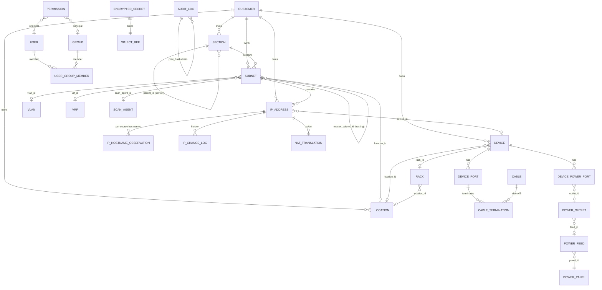

# jt-ipam 核心資料模型

> English: [DATA_MODEL.md](DATA_MODEL.md)

> 後端：SQLAlchemy 2.0（async）+ PostgreSQL 16 + Alembic，使用原生 `inet` / `cidr` / `macaddr` / `citext` / `jsonb` 型別。主鍵一律用 UUID（少數高頻 / 鏈式 log 表用 `bigint`）。
>
> 本文件追蹤**目前**的模型，依 `backend/app/models/` 下的 ORM 整理。Migration 在 `backend/alembic/versions/`（最新約 0070）。以「實體＋重要關聯/外鍵」的角度描述，不逐一列出所有欄位。

---

## 一、ER 圖（核心）



---

## 二、IPAM 核心

### 2.1 `customers` — 單位 / 管理單位 / 租戶
單位（管理單位）是 jt-ipam 的歸屬錨點。不同於 phpIPAM（只支援 section/subnet），`customer_id` 外鍵掛在 **section、subnet、IP 位址、裝置、機房、虛擬化叢集、VLAN** 上。單位範圍同時驅動 IP 關係鏈（例如 IP 只連到同單位的 VM）。

- `name`（唯一 slug）、`title`（顯示全名）、`description`、`contact`、`email`、`phone`、`address`。

### 2.2 `sections`（區段）
最上層分組。自參照 `parent_id`（SET NULL）做巢狀；`strict_mode`、`display_order`、選填 `customer_id`。

### 2.3 `subnets`（子網路）
- `section_id`（CASCADE，必填）、`master_subnet_id`（自參照巢狀）、`cidr`（原生 `cidr`）。
- `vlan_id`、`vrf_id`、`location_id`、`customer_id`、`gateway`（`inet`）、`dns_servers`（逗號分隔）。
- `is_pool`、`is_full`、`threshold_pct`（使用率通知）、`auto_dns`。
- `archived_at` — 非 NULL = 已歸檔：資料保留但不顯示、不掃描，重疊檢查也忽略（歸檔子網路底下的 IP 一併隱藏）。
- **掃描**：`scan_enabled`、`scan_method`（`text[]`，預設 `{icmp}`）、`scan_agent_id`（外鍵 → scan_agents；有設定則該子網路改走該掃描代理，而非本機）。
- `custom_fields`（jsonb）。`cidr` 建 GiST 索引。

### 2.4 `ip_addresses`（IP 位址）
- `subnet_id`（CASCADE）、`ip`（`inet`），`(subnet_id, ip)` 唯一，`ip` 建 GiST 索引。
- `hostname`（解析後的有效值）、`description`、`owner`、`note`、`state`（`active`/`reserved`/`offline`/`dhcp`/`used`）、`customer_id`、`device_id`。
- **MAC / 交換器位置**：`mac`（`macaddr`）、`mac_source`（目前 MAC 的來源，給 ARP 優先序用）、`switch_port`、`switch_port_confident`（由 FDB 推得；該 port 為 uplink/trunk 帶多個 MAC 時為 false）。
- **探測 / 掃描**：`exclude_from_ping`；`excluded_probes`（`text[]`）— 此 IP 略過的探測項目（icmp 與 `exclude_from_ping` 雙向同步）；`probe_last_run`（jsonb，`{probe: 時間}`，供「下次到期」顯示）。
- **OS 偵測**：`os_guess`（原始字串）、`os_family`（正規化家族 key，給前端配 icon；見 `core/os_fingerprint.py`）。
- **hostname 優先序**：`hostname_source_pin` — 把有效 hostname 固定以某來源為準（NULL = 跟全域優先序）。各來源的原始 hostname 存在 `ip_hostname_observations`。
- **多源活躍度**：`discovery_source`（`manual`/`scanner`/`librenms`/`dns`/`proxmox`/`opnsense`）、`last_seen_scanner`、`last_seen_librenms`、`last_seen_dns`、`effective_status`。
- `ptr_ignore`、`custom_fields`（jsonb）。

### 2.5 `ip_hostname_observations`
每個 `(ip, source)` 一筆，存該來源回報的 hostname。`IPAddress.hostname` 是依全域優先序加上單一 IP pin 從這些觀測值解析而來（解析邏輯在 `services/hostname.py`）。來源：manual / scanner / librenms / dns / proxmox / opnsense / wazuh / adguard。

### 2.6 `ip_change_log`
每筆 IP 異動的高頻歷史（created/deleted/hostname_changed/mac_changed/state_changed/online/offline/arp_changed/edited）。刻意**不**進稽核 SHA-256 鏈（sync 來的上下線 / ARP 事件太頻繁，塞進鏈會讓序列化變瓶頸）。保留 `ip_text` / `subnet_id` 快照，IP 刪除後歷史仍在（外鍵 SET NULL）。以 `(ip_id, created_at)` 建索引。

### 2.7 `nat_translations`
phpIPAM 的招牌 NAT，擴充對齊 OPNsense port-forward 規則。
- `type`（`one_to_one`/`many_to_one`/`port_forward`）、`src_ip_id`/`dst_ip_id`（外鍵 ip_addresses）、`src_port`/`dst_port`（加 `_to` 表埠範圍）、`protocol`、`src_interface`、`device_id`。
- OPNsense 對齊：`disabled`、`no_rdr`、`ip_version`、`src_not`/`dst_not`、`log`、`category`、`nat_reflection`、`pool_options`、`filter_rule`，以及 alias 參考（`src_alias`/`dst_alias`/`src_port_alias`/`dst_port_alias`/`redirect_alias`）。
- 來源追蹤：`source_origin`（`manual` / `phpipam` / `opnsense:<fw_uuid>`）+ `external_id`（兩者合起來唯一 = upsert 鍵）。

### 2.8 `ip_requests` / `ip_request_events`
IP 申請工作流，狀態機清楚（`pending → approved → fulfilled` / `rejected` / `cancelled`）。`ip_request_events` 是 timeline（每次狀態變化一筆）。核准時原子配發一個 IP（`allocated_ip_id`）。

---

## 三、掃描代理與探測模型

### 3.1 `scan_agents`（掃描代理）
多點掃描。代理部署在目標網段內（從中央主機跨網段掃描會被防火牆擋）。目前模型是 **push**：代理主動連向 server。
- `name`、`description`、`enabled`、`agent_url`（舊 pull 模型用，選填）。
- 驗證：`enroll_key_hash`（enrollment key 的 sha256，明文只在建立時回傳一次）給 push；`api_token_enc`/`api_token_nonce`（AES-GCM）給舊 pull。
- 遙測：`last_seen_at`、`last_error`、`agent_version`、`last_source_ip`。
- **探測設定**：`enabled_probes`（`text[]`，能力天花板，預設 `{icmp}`）、`probe_intervals`（jsonb `{probe: 秒}` 覆寫）、`available_probes`（`text[]`，代理回報它實際裝得起哪些 probe，給 UI 反灰用）、`force_scan_at`（admin「立刻執行一次」— 代理下次 poll 取走後清空，本輪所有探測強制到期立即跑）。

### 3.2 三層探測解析
某個 IP 實際會跑的探測項目是：

```
agent.enabled_probes  ∩  subnet.scan_method  −  ip.excluded_probes
```

也就是「代理能力天花板」交集「子網路選的方法」，再扣掉「單一 IP 的排除項」。探測目錄與預設值在 `app/core/scan_probes.py`。

---

## 四、裝置與實體層

### 4.1 `devices`（裝置）
- `name`、`fqdn`、`primary_ip_id`（外鍵 ip_addresses，use_alter）、`type`（`server`/`switch`/`router`/`firewall`/`ap`/`storage`/`ipmi`/`other`）、`vendor`、`model`、`serial`、`customer_id`、`custom_fields`。
- 機櫃擺放：`location_id`、`rack_id`、`u_position`、`u_size`、`rack_face`（`front`/`rear`）、`rack_side`（`full`/`left`/`right` — 半 U 裝置共用一個 U）。

### 4.2 `locations`（＝機房）與 `racks`（機櫃）
- **Location（機房）**：`name`（唯一）、`address`、`latitude`/`longitude`、`customer_id`、`floor_plan_path`（上傳的平面圖底圖；Location 同時當「機房」用）。
- **Rack（機櫃）**：`location_id`、`name`、`u_height`（預設 42）、實體 `width_mm`/`depth_mm`（平面圖依真實腳印按比例呈現）、`seq`（由左到右排序）、`numbering`（`top-down`/`bottom-up`）、`face`（`front`/`rear`）、平面圖位置 `pos_x`/`pos_y`（0..1 比例）、`pos_rot`（任意旋轉角度）、`pos_w`/`pos_h`。

### 4.3 佈線 — `device_ports`、`cables`、`cable_terminations`
NetBox 風但精簡（一張多型 termination 表，不拆多表）。
- **DevicePort**：裝置上的連接埠/介面；`type`（`network`/`front`/`rear`/`console`/`power`）、`peer_port_id`（front↔rear 對應，做跳接面板穿透）、`position`、`mac_address`（此埠自身實體 MAC，如 LibreNMS `ifPhysAddress`，非學到的對端 MAC）。`(device_id, name)` 唯一。
- **Cable**：`label`、`type`（`cat6`/`fiber-mm`/`fiber-sm`/`power`）、`color`、`length_m`、`status`（`planned`/`connected`/`decommissioned`）。
- **CableTermination**：纜線兩端；`side`（`A`/`B`）、多型 `(object_type, object_id)`（device / 跳接面板埠 / 插座…）、`port_label`。Cable Trace 沿這些端點加上埠的 `peer_port_id` 連結做多跳穿透。

### 4.4 電力 — NetBox 風
- **PowerPanel** → **PowerFeed**（`voltage_v`、`amperage_a`、`phase` single/three、`supply_type` ac/dc、選填 `rack_id`）→ **PowerOutlet**（`feed_id`、`rack_id`、`label`）。
- **DevicePowerPort**：裝置側電源埠（PSU / 電源輸入，如 PSU1/PSU2）、`outlet_id`（外鍵 power_outlets；NULL = 尚未接線）、`max_watts`。一台裝置可有多個，故能建模雙電源跨 A/B 迴路備援。

---

## 五、全域基礎設施（進階資源）

這些屬全域基礎設施（無法逐物件授權）；UI 是否顯示由 `require_global_read` 控管。皆支援 CRUD/PATCH。

- **`vlan_domains` / `vlans`**：VLAN `number`（1–4094，同 domain 內唯一）、`name`、選填 `customer_id` / `section_id`。**`device_vlans`** 對應 `librenms_devices ↔ vlans`（pull-only，由 LibreNMS sync 寫入；刻意掛在 LibreNMS 裝置而非 jt-ipam Device）。
- **`vrfs`**：`name`（唯一）、`rd`（Route Distinguisher）、`allow_overlap`。
- **`asns`**：`asn`（bigint，唯一）、`rir`、選填 `tenant_id`。
- **租戶**：`tenant_groups`（自參照）→ `tenants`（`slug`、`group_id`）。
- **電路**：`providers` → `circuits`（`cid` 同 provider 內唯一、`type_id` → `circuit_types`、`status`、日期、`monthly_fee_cents`、`commit_rate_kbps`、非對稱 `up_kbps`/`down_kbps`、選填固定 IP 欄位 `ip_address`/`gateway`/`netmask`/`dns_servers`、`device_id` 指 WAN 端裝置、`tenant_id`）。
- **聯絡人**：`contact_groups`（自參照）、`contact_roles`、`contacts`，以及 `contact_assignments`（用多型 `(object_type, object_id)` 把聯絡人＋角色指派到任意物件）。
- **無線**：`wireless_ssids`（`ssid`、`auth_type`、`vlan_id`、`tenant_id`）、`wireless_links`（點對點 A/B 裝置）。
- **VPN**：`vpn_tunnels` — `type`（ipsec_ikev1/ikev2/wireguard/openvpn/l2tp/vxlan/vpls/evpn/other）、A/B 裝置＋端點、WireGuard `local_public_key`/`peer_public_key` 供可靠對接、`pairing_method`（`wireguard_pubkey` 可靠 / `ipsec_endpoint` best-effort）供 UI 標示可信度。

---

## 六、整合

每個整合都有一張 **instance** 表（連線 metadata；API key/密碼以 AES-GCM 加密，多以雙欄 `*_enc` / `*_nonce` 或透過 `encrypted_secrets` 儲存），加上若干 **synced** 表（pull-only 快取）。

### 6.1 LibreNMS — `librenms.py`
- **LibreNMSInstance**：`api_url`、加密 token、各項開關（`sync_devices`/`sync_arp`/`sync_fdb`/`sync_vlans`/`use_for_status`/`auto_add_devices`）、`scope_subnet_ids`（jsonb — 限定 IP 解析範圍，化解重疊網段）、間隔＋last_sync/error。
- **LibreNMSDevice**：拉回的裝置（`legacy_device_id` = LibreNMS id）、`hostname`/`sysname`/`primary_ip`/`hardware`/`os`/`status`、`jt_ipam_device_id` 連結。
- **ARPEntry**：來自 `/resources/ip/arp/` 的 IP↔MAC，含 `interface`/`vrf`，用來補 IP 的 MAC。
- **FDBEntry**：來自 `/devices/{id}/fdb` 的 MAC 位置（`port_name`、`vlan_id_num`），用來推導交換器埠。

### 6.2 Wazuh — `wazuh.py`
- **WazuhInstance**：`api_url`、`api_user` + 加密密碼、`verify_tls`。
- **WazuhAgent**：每次 sync 的代理（`agent_id`、`ip`、`status`、OS/版本、`group`、keep-alive），透過 `jt_ipam_address_id` 對應到 IP，加上漏洞摘要計數（`cve_critical_count`/`cve_high_count`/`cve_summary_at`）。

### 6.3 OPNsense 防火牆 — `firewall.py`、`firewall_rule.py`、`nat.py`、`dhcp.py`
- **OPNsenseFirewall**：加密 `api_key` + `api_secret`、`verify_tls`、同步開關（`sync_dhcp`/`sync_arp`/`sync_openvpn`/`sync_rules`/`sync_nat`/`sync_aliases`）。
- **OPNsenseAliasMapping**：jt-ipam 範圍 → OPNsense alias 的推送規則；`selector`（jsonb：section/subnet/tag/custom_field）、`direction`（push/pull/both）、上次同步狀態。
- **OPNsenseSyncedAlias**：從 OPNsense 拉回的 alias（唯讀檢視用，`content`、`member_count`）。
- **OPNsenseRule**：拉回的防火牆規則唯讀快取（`legacy_uuid`、action/interface/direction/protocol、src/dst net & port、`raw` jsonb）。
- **DHCPPoolRange**：從防火牆（Kea/ISC）同步回的 DHCP 發放範圍 — `subnet_cidr`、`start_ip`/`end_ip`；落在範圍內的 IP 標示為 DHCP。

### 6.4 Proxmox 虛擬化 — `virt.py`
- **ProxmoxInstance**：PVE API 連線（`api_url` + `extra_api_urls` 供節點換手、`auth_username`/`auth_token_id`、secret 走 `encrypted_secrets`、`verify_tls`）。
- **VirtCluster**：Proxmox 叢集（`type`、`is_standalone`、`location_id`、`tenant_id`、`customer_id`）。
- **VirtualMachine**：VM/CT（`legacy_vmid`、`node`、`kind` vm/ct、`status`、vcpus/memory/disk）、`primary_ip_id`、`device_id` 連結、`is_template`。
- **VMInterface**：`mac`、`primary_ip`、`bridge`、`vlan_id`。

### 6.5 DNS — `dns.py`
- **DNSServer**：provider 抽象 `type`（powerdns/bind9/unbound_opnsense/windows_dns/univention_ucs）；密鑰在 `encrypted_secrets`。
- **DNSZone**：`type`（forward/reverse）、`managed`、`associated_subnet_ids`（`uuid[]`）。
- **DNSRecord**：`type`（A/AAAA/PTR/CNAME/MX/TXT/SRV/NS/SOA）、`source`（manual/from_ipam/from_dns_pulled）、`consistency_state`（consistent/dns_only/ipam_only/mismatch）供不一致報表、選填 `ipam_address_id` 反向連結。

### 6.6 AdGuard Home — `adguard.py`
- **AdGuardInstance**：HTTP basic-auth（加密密碼）、`sync_clients` / `sync_rewrites` 開關。pull-only 補充 IPAM 資料。

### 6.7 phpIPAM 遷移 — `migration_mapping.py`
- **PhpIPAMMigrationMapping**：`(object_type, legacy_id)` → `jt_ipam_id`，附 `last_synced_hash`（canonical JSON 的 sha256）供 idempotent 重跑 / 偵測變更，及 `last_seen_at` 供偵測刪除。

### 6.8 OUI — `oui.py`
- **OUIVendor**：IEEE MAC 廠商對照。PK = 6 位 hex `prefix`（前 24 bits）、`short_name` / `name`、`source`（Wireshark `manuf`，每月更新）。

---

## 七、AI / LLM

- **`ai_chat_conversations`**（屬某 user，`title` 取自第一句問題）→ **`ai_chat_messages`**（`role` user/assistant、`content`、`model`、`elapsed_ms`；`created_at` 用 `clock_timestamp()` 保證同回合 user→assistant 排序正確）。只存最終問答，不存 tool trace（含內部資料）。保留天數由 admin 透過 `system_settings.ai_chat.retention_days` 設定。

---

## 八、安全、RBAC 與系統

### 8.1 `users` / `groups` / `user_group_members`
- **User**：`username`/`email`（citext 唯一）、`password_hash`（argon2id；外部驗證為 NULL）、`auth_provider`（local/ldap/radius/saml/oidc）、`external_subject`、`is_active`、`is_admin`、加密 TOTP（`totp_secret_enc`/`totp_nonce`）、帳號鎖定（`failed_login_count`/`locked_until`）、`last_login_at`/`last_login_ip`。CHECK：local 使用者必須有密碼。
- **Group**：`name`（citext 唯一）、`is_builtin`。成員透過 `user_group_members`（複合 PK）。

### 8.2 `permissions` — 物件層級 RBAC（預設關閉，A01）
物件層級授權：`(object_type, object_id, principal_type, principal_id, level)`。
- `object_type` ∈ `customer / section / subnet / ip / device / rack / location`（7 種可授權物件）。
- `object_id` NULL = 萬用（該類型全部）。
- `principal_type` ∈ `user / group`；`level` ∈ `read / write / admin`。
- `(object_type, object_id, principal_type, principal_id)` 唯一。未授權 = 無存取。`visible_ids()` 回 None（全部可見 — admin 或萬用）/ set（限定）/ 空 set（無）；列表 / 詳情 / 搜尋 / 儀表板彙總 / 計數全部都要依此縮放。

### 8.3 `audit_logs` — SHA-256 鏈（A08）
`bigint` PK；`actor_user_id`/`actor_ip`/`actor_user_agent`、`object_type`/`object_id`（UUID）、`action`、`diff`（jsonb，敏感欄位 redact）、`request_id`。`prev_hash` + `this_hash` 構成可驗竄改的鏈；寫入用 advisory lock 序列化。`object_id` 必須是真正的 UUID（別塞非 UUID）。

### 8.4 `encrypted_secrets`（A02 / A04）
任意敏感欄位的 AES-256-GCM 保險庫。`(object_type, object_id, field, key_id)` 唯一；`ciphertext` + `nonce`。承載 DNS/Proxmox 帳密、SNMP community、TOTP 等。

### 8.5 `api_tokens`
`token_hash`（sha256 — 明文不存）+ `token_prefix` 供識別、`scopes`（`text[]`）、`object_filters`（jsonb ACL）、`expires_at`（必填）、使用 / 撤銷時間。

### 8.6 `custom_field_definitions`
admin 為 `object_type` ∈ `subnet / ip / device` 定義欄位。`field_type` ∈ text/int/float/bool/date/select/multi_select/regex，含 `options`/`validation_regex`/`required`/`display_order`。值經驗證後存進各實體的 `custom_fields` jsonb。`(object_type, name)` 唯一。

### 8.7 `user_preferences`
每使用者（PK = user_id）：`locale`（zh-TW/en-US）、`theme`、`timezone`、`calendar`（gregorian/minguo）、`page_size`、`table_columns`（jsonb — 各表顯示欄位）、`pinned_subnet_ids`（jsonb — 儀表板「常用子網路」）、`pinned`（jsonb `{namespace: [id…]}` — 機房/地點/機櫃等通用釘選，存後端而非 localStorage）。註：上線判定閾值已改為全域設定（`system_settings.online_grace_minutes`），不再是個人偏好。

### 8.8 `system_settings`
admin key/value 設定（`key` PK、`value` jsonb、`updated_by`），覆寫 env。內含 hostname / ARP-MAC / 裝置名稱 / 裝置型號 / OS 解析的**來源優先序**、`online_grace_minutes`、LLM 設定、AI chat 保留天數等。

### 8.9 `notifications` / `webhook_subscriptions`
- **Notification**：站內、每使用者（`severity`、`title`、`body`、`link`、選填 `object_type`/`object_id`、`read_at`）。
- **WebhookSubscription**：出站（`target_url`、`events` `text[]`、加密 HMAC `secret`、`headers`、失敗追蹤）。發送前過 `safe_http` SSRF 檢查。

### 8.10 `background_tasks`
長時間作業的統一記錄（`librenms.sync` / `opnsense.sync` / `dns.sync` / `phpipam.migration` / `scanner.run` …）：`kind`、`status`（pending/running/succeeded/failed/cancelled）、`target_*`、`progress`（0–100）、`summary`（jsonb）、時間戳。於 `/api/v1/tasks` 呈現。

---

## 九、命名與索引慣例

- 主鍵：實體用 UUID（時間排序）；`audit_logs` / `phpipam_migration_mapping` 用 `bigint`。
- 列舉：`text` + CHECK constraint（避免 PG enum 改值困難）。
- 時間欄位：一律 `timestamptz`（UTC 儲存）。
- 網路型別：原生 `inet` / `cidr` / `macaddr`，並在 `subnets.cidr` 與 `ip_addresses.ip` 建 GiST 索引供包含 / 重疊查詢。
- 多型連結用 `(object_type, object_id)`（cable termination、contact assignment、encrypted secret、notification）。
- 避免軟刪除；歸檔用 `archived_at`（subnet）、撤銷時間（token）視需要處理。

---

## 十、Migration 策略

- Alembic auto-generate 一律人工 review，不直接套用。
- Migration 實質 forward-only；保留 `downgrade()` 給開發環境。
- prod 前先在 staging / 乾淨容器跑過。目前 head 約在 `0070`。
